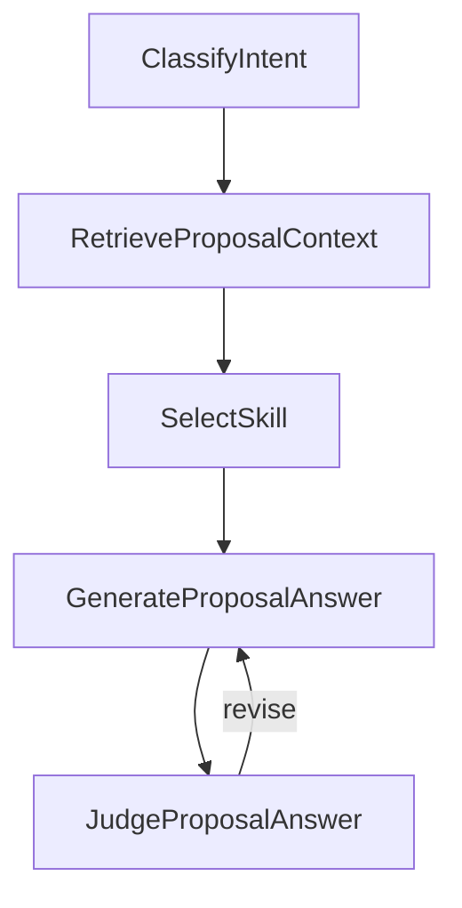

# DAIMON Horizon Proposal Agent

PocketFlow example for a proposal co-writer focused on the DAIMON Horizon Europe project.

The agent can answer flexible proposal-writing queries such as:

```bash
python cookbook/pocketflow-daimon-proposal-agent/main.py "create a draft of WP3"
python cookbook/pocketflow-daimon-proposal-agent/main.py "what is missing in WP5?"
python cookbook/pocketflow-daimon-proposal-agent/main.py "which partner should work on WP7?"
python cookbook/pocketflow-daimon-proposal-agent/main.py "check whether WP3 aligns with the call"
```

Run the minimal web UI with:

```bash
python cookbook/pocketflow-daimon-proposal-agent/web_app.py
```

Then open `http://127.0.0.1:8765`. The left panel shows the current result document; the right panel is the chat. Each message still creates the same backend log folder and PDF artifacts as the CLI.

## Design



The agent combines:

- a local project memory generated from `data_daimon`
- source-priority rules, with `last_news.txt` treated as the freshest project source
- lightweight lexical retrieval over Docling-structured section/paragraph chunks
- task-specific markdown skills
- a reviewer loop that checks freshness, call alignment, and unsupported partner claims

Install dependencies with:

```bash
pip install -r cookbook/pocketflow-daimon-proposal-agent/requirements.txt
```

The Docling versions are pinned because recent `docling-parse` wheels can force a local C++ build on macOS 13 arm64 environments. The pinned stack uses `docling-parse` 1.6.2, which has prebuilt macOS 13 arm64 wheels.

## Memory

The memory is written to:

```text
project_memory.json
```

Rebuild it with:

```bash
python cookbook/pocketflow-daimon-proposal-agent/main.py --rebuild-memory --show-sources "summarize the current consortium"
```

Inspect the memory without calling the LLM:

```bash
python cookbook/pocketflow-daimon-proposal-agent/main.py --inspect-memory
```

## Logs and Outputs

Every normal run creates a timestamped folder under:

```text
cookbook/pocketflow-daimon-proposal-agent/logs/
```

Each run folder contains:

- `trace.json` with every recorded step, prompt, retrieved passage, explicit decision, visible model output, reviewer feedback, and iteration
- `trace.md` with the same trace in a readable Markdown format
- `answer.md` with the final answer
- `answer.pdf` with the final answer saved as a PDF

Use a custom location with:

```bash
python cookbook/pocketflow-daimon-proposal-agent/main.py --logs-dir /tmp/daimon-agent-logs "create a draft of WP2"
```

Use more generator/reviewer iterations with:

```bash
python cookbook/pocketflow-daimon-proposal-agent/main.py --max-attempts 3 "what is missing in WP5?"
```

The logs include explicit rationale fields and reviewer feedback produced by the workflow. They do not expose hidden model chain-of-thought.

Copy `.env.example` to `.env` if you want to keep local OpenAI settings beside this example. The script loads `.env` automatically when present. Supported variables are:

- `OPENAI_API_KEY`
- `OPENAI_MODEL`
- `DAIMON_DATA_DIR`, optional path to the source documents directory
- `DAIMON_DOCLING_OCR`, optional OCR toggle; defaults to `false`

DOCX and PDF ingestion uses Docling. The memory builder converts each source into Docling's structured document model and then chunks by hierarchy/sections/paragraphs. PDF OCR is disabled by default to avoid unsupported OCR model configurations; enable `DAIMON_DOCLING_OCR=true` only for scanned PDFs and a working OCR backend. If Docling is missing or a source cannot be converted into real text, the run fails instead of indexing placeholder text. Install `docling` or provide source files Docling can convert, then rebuild memory.

Partner memory is built from both `last_news.txt` and `partners table.pdf`. The partner table supplies the full consortium roster, organizations, locations, and WP assignments. Web profile notes are attached from `partner_web_profiles.json`, which records the one-time search status, queries, and source URLs where reliable matches were found. Unverified profiles are marked as such rather than promoted to facts.

## Freshness Rule

The agent is instructed to treat `last_news.txt` as the highest-priority source. In the current notes this means:

- the consortium is closed
- Mireia Vendrell is added in Barcelona for data collection in Spain
- Desirée Schmuck is added in Vienna for AI-related changes in technology users
- the separate guidelines WP has been removed
- guidelines should appear as deliverables inside each WP

## Researcher Profiles

A one-time web search was used to seed researcher-profile fields. Exact profiles were not reliable enough to encode as firm facts, so the memory marks those web profiles as unresolved and only relies on roles stated in `last_news.txt`.
